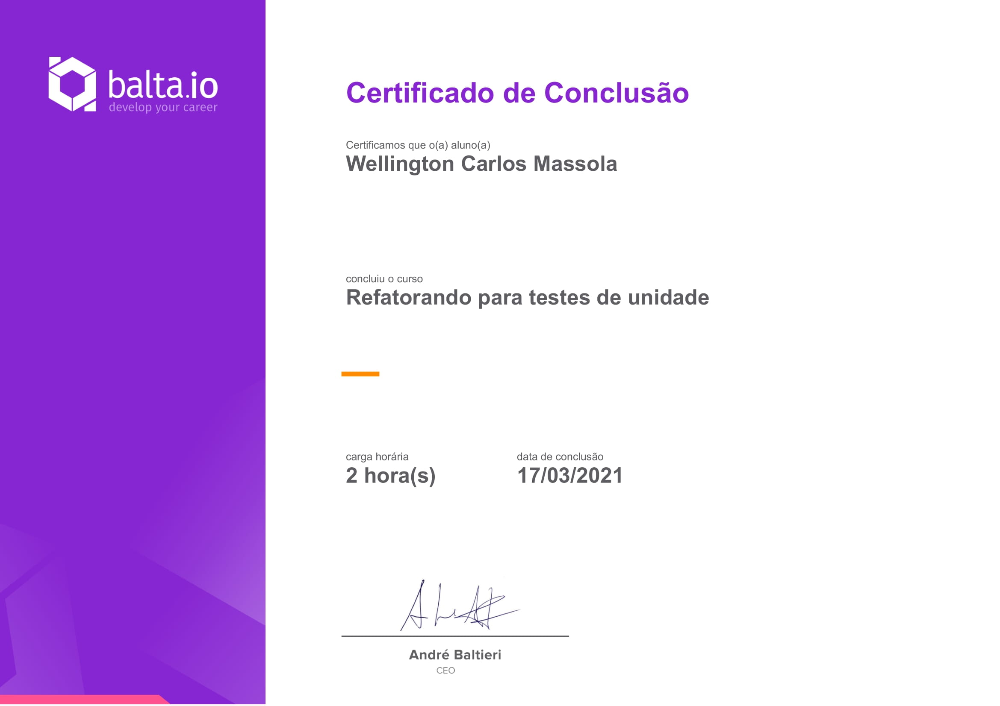

# Curso [balta.io 7182](https://balta.io/cursos/refatorando-para-testes-de-unidade)

Curso Backend C#.  

Link do curso: [https://balta.io/cursos/refatorando-para-testes-de-unidade](https://balta.io/cursos/refatorando-para-testes-de-unidade)

Tecnologias:  

## Refatorando para testes de unidade

Neste curso vamos refatorar um código legado, altamente acoplado, traduzindo-o para boas práticas e testes de unidade.

## Instrutor

André Baltieri - 8x Microsoft MVP

## Progresso do curso

1) Modelando o Domínio:
   - [x] Introdução
   - [x] Entidade de Cliente
   - [x] Entidade Base
   - [x] Entidade de Produto
   - [x] Entidade de Desconto
   - [x] Entidade do Item do Pedido
   - [x] Entidade do Pedido
2) Validações:
   - [x] Domain Notification
   - [x] Validando o Pedido
   - [x] Validando o Item do Pedido
3) Testando as Entidades:
   - [x] Setup
   - [x] Técnicas e Convenções
   - [x] Testando a Geração do Pedido
   - [x] Testando o Status do Pedido
   - [x] Testando o Pagamento do Pedido
   - [x] Testando o Cancelamento do Pedido
   - [x] Testando a Adição de Item
   - [x] Testando Item Inválido
   - [x] Testando o Total do Pedido
   - [x] Testando Desconto Expirado
   - [x] Testando Desconto Inválido
   - [x] Testando um Desconto Válido
   - [x] Testando a Taxa de Entrega
   - [x] Testando um pedido sem cliente
4) Testando Queries:
   - [x] Introdução
   - [x] Criando as Queries
   - [x] Repository Pattern
   - [x] Criando os Repositórios
   - [x] Mockando os Repositórios
   - [x] Testando as Queries
5) Commands:
   - [x] Commands
   - [x] Padronizando o Retorno
   - [x] CreateOrderCommand
   - [x] Testando os Commands
6) Handlers:
   - [x] Handlers
   - [x] OrderHandler
   - [x] Utilitários
   - [x] OrderHandlerTests
   - [x] Testando o Handler
7) Conclusão:
   - [x] Parabéns, você conseguiu!

